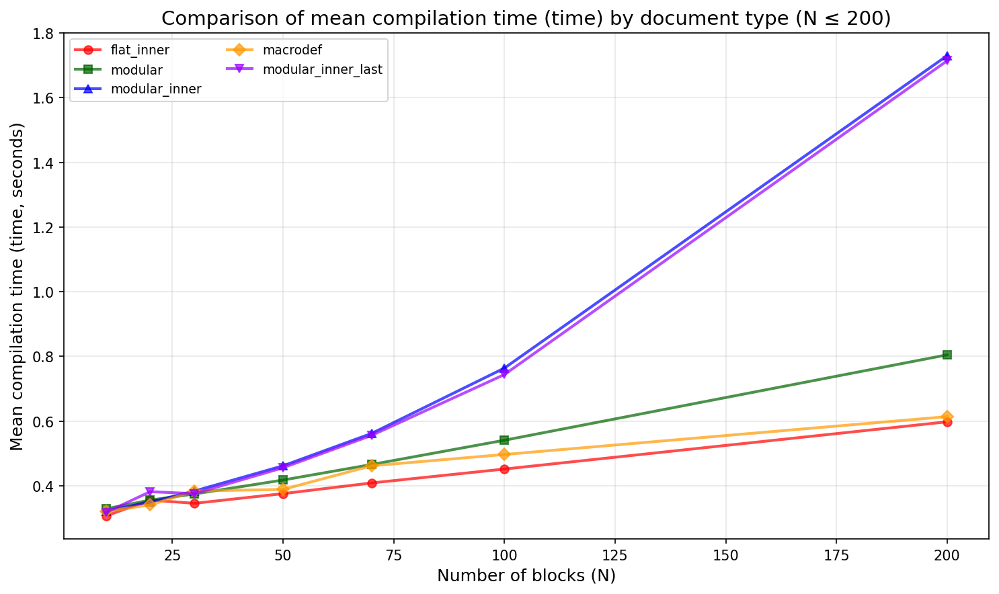
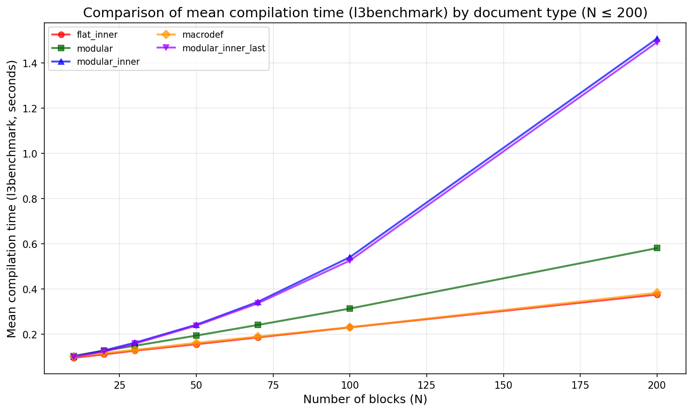
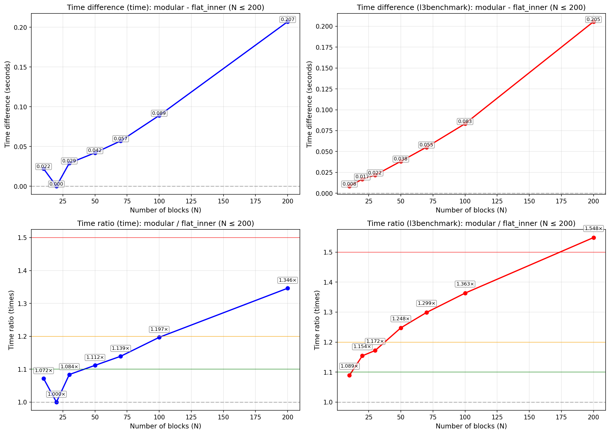
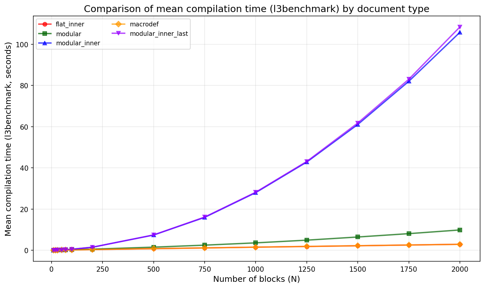
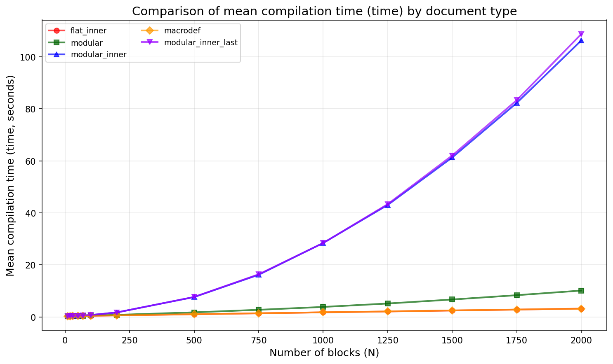
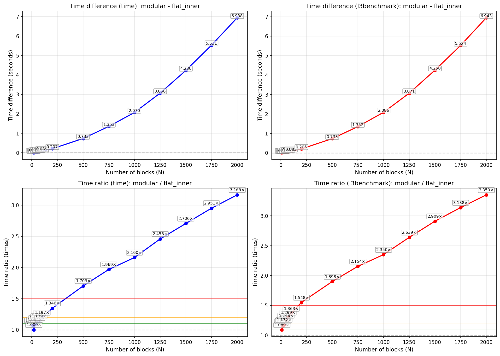
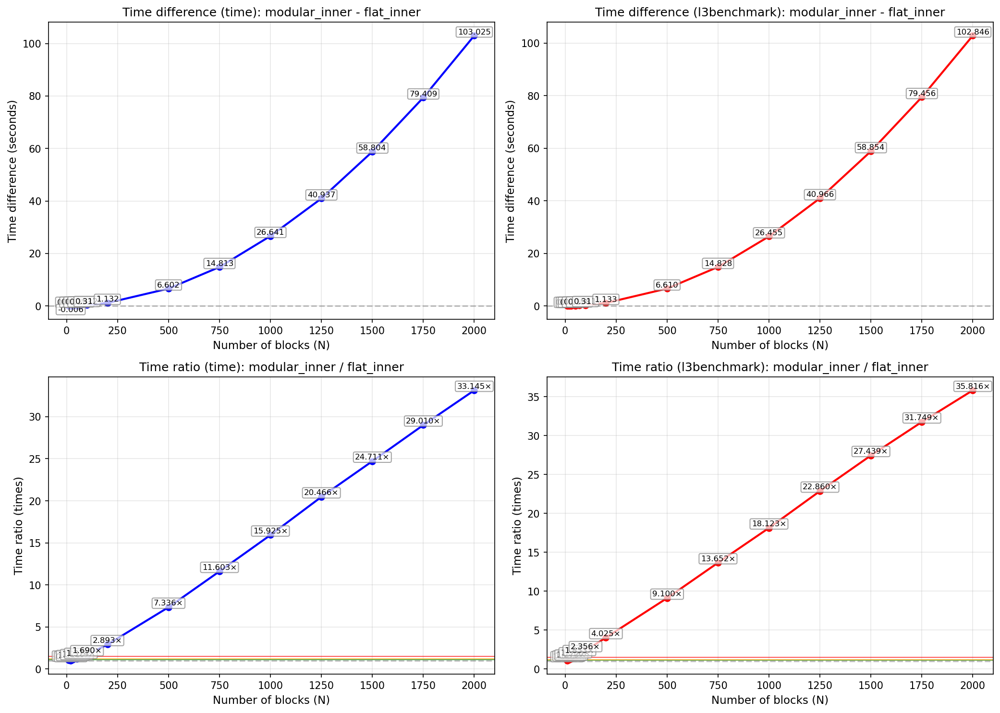
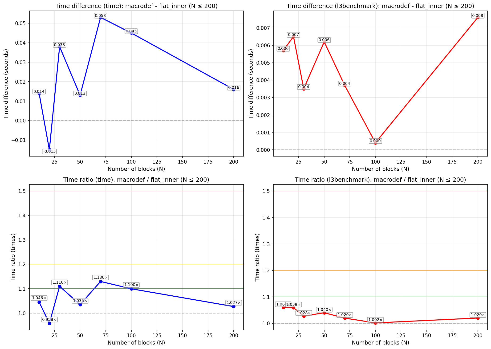
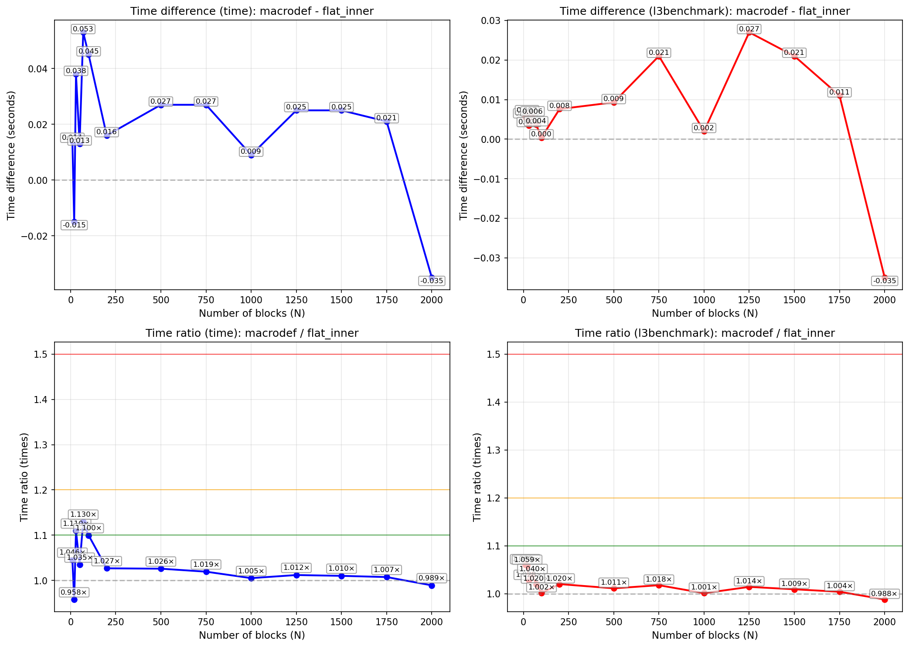

### Предварительные сведения
Прежде всего, нам необходимо договориться об операционной системе и дистрибутиве LaTeX. Я буду использовать Arch Linux (ядро: Linux 6.17.9-arch1-1) и TeX 3.141592653-2.6-1.40.26 (TeX Live 2024/Arch Linux).

Далее нам нужно определиться с тем, как и что мы будем измерять.

#### Как измерять время
Поскольку основное, что нас интересует, -- это время компиляции: `pdflatex <name>.tex`, то мы можем воспользоваться простой командой `time`. Однако в LaTeX существует пакет `l3benchmark`, при помощи которого мы можем замерить интересующее нас время, например, следующим образом:
```tex
\RequirePackage{l3benchmark}
\ExplSyntaxOn
\AfterEndDocument { \benchmark_toc: }
\use:n
  {
    \benchmark_tic:
  }
\ExplSyntaxOff
```
(см. этот [ответ](https://tex.stackexchange.com/questions/505770/how-to-measure-the-compilation-time-of-a-document))

Мы также должны понимать, что, например, время от `time` может сильно колебаться из-за влияния операционной системы. А время, измеренное при помощи `l3benchmark` указанным выше способом, не включает время инициализации движка TeX и окончательную обработку для включения шрифтов.

Тем не менее, выполнив несколько запусков и найдя минимальное, среднее и максимальное значения, мы получим довольно хорошее представление.

#### Что измерять

Теперь нам необходимо определиться с тем, что мы будем измерять. В вопросе говорится, что в `des.tex` и `data.tex` в основном содержится текст длиной в один абзац, с возможным включением формул. Для простоты и опираясь на ваш тестовый пример из вопроса, мы предположим, что в `des.tex` и `data.tex` содержится лишь один абзац текста.

Нам также потребуется некоторая базовая линия, относительно которой мы будем смотреть и говорить, сильно ли изменилось время компиляции или нет. В нашем случае этой базовой линией будет документ, в который мы напрямую вставили блоки:
```tex
\documentclass[a4paper]{report}
\usepackage{graphicx}
\usepackage{geometry}
\usepackage{float}
\usepackage[language=english]{lipsum}
\usepackage{etoolbox}
\usepackage{l3benchmark}

\newcommand{\fig}[1]{\begin{figure}[H]\includegraphics{#1}\end{figure}}
\newcommand{\merge}[4]{\par\textbf{#1}\par\fig{#2}#3\par#4\par}

\ExplSyntaxOn
\AfterEndDocument { \benchmark_toc: }
\use:n
  {
    \benchmark_tic:
  }
\ExplSyntaxOff
\begin{document}

\merge{Block 1}{images/test-image-1.png}{\lipsum[2]}{\lipsum[3]}

\merge{Block 2}{images/test-image-2.png}{\lipsum[3]}{\lipsum[4]}

...

\merge{Block N}{images/test-image-N.png}{\lipsum[1]}{\lipsum[2]}

\end{document}
```
Далее в повествовании он будет именоваться как документ `flat` или документ типа `flat`.

Для чистоты эксперимента мы также будем рассматривать вариант документа, в который текст добавляется не при помощи команды `\lipsum`, а напрямую, как в реальных документах. Это будет критически важно при анализе времени работы пакета `catchfilebetweentags`.

Для этого мы подготовим файл `lipsum.py`, в котором укажем тот же самый текст, что мы получали при вызове `\lipsum[1]`, `\lipsum[2]`, ..., `\lipsum[5]`. С одной лишь особенностью: мы добавим символ новой строки после символов точки и запятой:
```py
paragraphs = [  #
    """Lorem ipsum dolor sit amet, %
consectetuer adipiscing elit. %
Ut purus elit, %
vestibulum ut, %

Duis  nibh mi, %
congue eu, %
accumsan eleifend, %
sagittis quis, %
diam. %
Duis eget orci sit amet orci dignissim  rutrum.%
""",
...
```
Из-за специфики работы пакета `catchfilebetweentags` нам необходимо экранировать перенос на следующую строку при помощи `%`. Мы вернёмся к этому, когда будем говорить о недостатках пакета.

Эти ухищрения нужны лишь для того, чтобы получить в генерируемом `des.tex` не просто три строчки:
```tex
%<*Des1>
\lipsum[2]
%</Des1>
```
а несколько:
```tex
%<*Des1>
Nam dui ligula, %
fringilla a, %
euismod sodales, %
sollicitudin vel, %
...
nascetur ridiculus mus. %
Aliquam tincidunt urna. %
Nulla ullamcorper vestibulum turpis. %
Pellentesque cursus luctus mauris.
%</Des1>
```
Соответственно, когда мы будем добавлять текст напрямую, то к типу документа мы будем добавлять `_inner`. Таким образом, наша вторая базовая линия -- это измерения для документов типа `flat_inner`:
```tex
\documentclass[a4paper]{report}
\usepackage{graphicx}
\usepackage{geometry}
\usepackage{float}
\usepackage[language=english]{lipsum}
\usepackage{etoolbox}
\usepackage{l3benchmark}

\newcommand{\fig}[1]{\begin{figure}[H]\includegraphics{#1}\end{figure}}
\newcommand{\merge}[4]{\par\textbf{#1}\par\fig{#2}#3\par#4\par}
\ExplSyntaxOn
\AfterEndDocument { \benchmark_toc: }
\use:n
  {
    \benchmark_tic:
  }
\ExplSyntaxOff
\begin{document}

\merge{Block 1}{images/test-image-1.png}{%
Nam dui ligula, %
fringilla a, %
euismod sodales, %
...
Nulla ullamcorper vestibulum turpis. %
Pellentesque cursus luctus mauris.%
}{%
Nulla malesuada porttitor diam. %
Donec felis erat, %
congue non, %
...
Vestibulum pellentesque felis eu massa.%
}
...
```
Аналогично мы поступим для документов типа `modular`. В них мы используем:
```tex
%<*Des1>
\lipsum[2]
%</Des1>
```
и
```tex
%<*Data1>
\lipsum[3]
%</Data1>
```
А в `modular_inner`:
```tex
%<*Des1>
Nam dui ligula, %
fringilla a, %
...
Nulla ullamcorper vestibulum turpis. %
Pellentesque cursus luctus mauris.
%</Des1>
```
и для `%<*Data1>` аналогично.

Также мне лично показалось интересным измерить случай, когда в `\ExecuteMetaData` мы обращаемся всегда к самому последнему тегу, то есть к `%<*DataN>`, который определён в конце документа `data.tex`. Назовём такие документы документами типа `modular_inner_last`. (Из расчётов будет видно, что для них время соизмеримо с `modular_inner`, поэтому подробности можно опустить.)

Также мы измерим время для одного из предложенных мной решений через `\@namedef` и `\@nameuse`. Назовём такие документы документами типа `macrodef`.

#### Краткая сводка
Таким образом, у нас будет 6 различных случаев:

1. `flat` -- наиболее близкий аналог примера, указанного в вопросе, но без разделения на несколько `.tex` файлов.
2. `flat_inner` -- аналог `flat`, но текст включается напрямую, а не через `\lipsum`.
3. `modular` -- наиболее близкий аналог примера, указанного в вопросе.
4. `modular_inner` -- аналог `modular`, но текст включается напрямую, а не через `\lipsum`.
5. `modular_inner_last` -- аналог `modular_inner`, но вызывается всегда самый последний тег из определённых в `des.tex` и `data.tex`.
6. `macrodef` -- решение через `\@namedef` и `\@nameuse`.

### Реализация измерений

Как можно видеть из раздела "Предварительные сведения", нам потребуется довольно много файлов и различных замеров. Чтобы облегчить процесс их создания, а также подсчётов, мы будем использовать скрипты на языке `Python`. Для удобства каждый скрипт имеет опцию `-h` (`--help`), чтобы получить дополнительную информацию.

Ниже я также приведу команды, которые использовал сам, для получения представленных далее результатов.

#### Генерация изображений
Поскольку в вопросе также используются изображения, нам необходимо их сгенерировать. Воспользуемся:
```bash
python ./generate_images.py -n 2000 \
 --font-size=12 \
 --size=120,60 \
 --seed=5217659638834040483 \
 -i ./info_image.log
```
Поскольку максимальное число блоков, для которых мы будем проводить измерение, составит 2000, то сразу сгенерируем 2000 изображений. Я также зафиксировал `seed`, чтобы была возможность сгенерировать аналогичные изображения. (Элемент случайности влияет лишь на цвет фона изображения, поэтому в целом это необязательно.)

#### Необязательная генерация

Если возникли недопонимания, что из себя представляют документы различных типов (`flat`, `flat_inner`, ...), то можно сгенерировать тестовый пример без измерений, просто чтобы посмотреть или измерить в дальнейшем вручную, а не через скрипт `benchmark_latex.py`.

Так, например, для получения файла типа `flat` необходимо выполнить следующее:
```bash
python ./generate_flat_version.py -n 10
```
(для смены выходной директории, количества блоков и других параметров смотрите `help`.)

Для получения файла типа `flat_inner` можно использовать:
```bash
python ./generate_flat_version.py -n 10 --inner
```
Для получения файла типа `modular`:
```bash
python ./generate_modular_version.py -n 10
```
Для получения файла типа `modular_inner`:
```bash
python ./generate_modular_version.py -n 10 --inner
```
А для получения файла типа `modular_inner_last`:
```bash
python ./generate_modular_version.py -n 10 --inner --last-tag
```

После чего можно вызвать `time pdflatex ...` и получить время при помощи `time` или, если проанализировать `.log` файл, найти там строчку:
```text
(l3benchmark) + TOC: 4.23 s
```

#### Получение измерений

Для автоматизации получения результатов был написан скрипт `benchmark_latex.py`. Так, например, для получения данных для файлов типа `modular` было использовано:
```bash
time python benchmark_latex.py \
--type modular \
--images-dir images -k 5 \
-o ./benchmark_result_modular/benchmark_result_modular.csv
```
что выполнит замеры для `N` (количество блоков): `10, 20, 30, 50, 70, 100, 200, 500, 750, 1000, 1250, 1500, 1750, 2000`.
И для каждого `N` мы повторяем запуск `k` раз, чтобы получить минимальное, максимальное и среднее значения.

Этот процесс может занять какое-то время в зависимости от того, какие и сколько `N` вы указали, а также какое число было указано для опции `k`. В моём случае приведённая выше команда выполнялась около `7` минут. А аналогичная команда для `modular_inner`:
```bash
time python benchmark_latex.py \
--type modular_inner \
--images-dir images -k 5 \
-o ./benchmark_result_modular_inner/benchmark_result_modular_inner.csv
```
уже около 30 минут.

После выполнения указанных выше команд мы получим директорию `experiment`:
```bash
./experiment
├── flat
│   ├── flat_10
│   ├── flat_20
│   ├── flat_30
│   ...
│   ├── flat_1500
│   ├── flat_1750
│   └── flat_2000
├── modular
│   ├── modular_10
│   ├── modular_20
│   ├── modular_30
│   ...
│   ├── modular_1500
│   ├── modular_1750
│   └── modular_2000
├── modular_inner
│   ├── modular_inner_10
│   ├── modular_inner_20
│   ├── modular_inner_30
│   ...
│   ├── modular_inner_1500
│   ├── modular_inner_1750
│   └── modular_inner_2000
...
├── macrodef
│   ├── macrodef_10
│   ├── macrodef_20
│   ├── macrodef_30
│   ...
│   ├── macrodef_1500
│   ├── macrodef_1750
│   └── macrodef_2000
└── flat_inner
    ├── flat_inner_10
    ├── flat_inner_20
    ├── flat_inner_30
    ...
    ├── flat_inner_1500
    ├── flat_inner_1750
    └── flat_inner_2000
```
В каждой из них будет документ `main.tex`, для некоторых типов ещё `data.tex`, `des.tex` и результат последнего из `k` запусков.

А в указанных при запуске `.csv` файлах -- непосредственные результаты.

### Визуализация результатов

После чего нам необходимо лишь визуализировать `.csv` файлы. Для этого мы опять же воспользуемся скриптами.

#### flat vs flat_inner

Прежде всего заметим разницу между `flat` и `flat_inner`:
Для построения воспользуемся командой.
```bash
python plot_flat_comparison.py \
--flat-csv ./benchmark_result_flat.csv \
--flat-inner-csv ./benchmark_result_flat1.csv \
--output-dir plot_flat_vs_flat_inner
```
##### При помощи time
 


##### При помощи l3benchmark

 

Как и ожидалось, без вызова `\lipsum` время сборки будет быстрее. Также видим заранее ожидаемые колебания при измерении через `time`.

Поскольку `flat_inner` слегка быстрее, чем `flat`, то в качестве базовой линии мы возьмём его. (В скрипте `plot_latex_benchmark.py` можно задать другую базовую линию, см. `--help`.)

#### Основные результаты

Для получения основных результатов мы воспользуемся следующими командами:
```bash
python plot_latex_benchmark.py \
--baseline=flat_inner \
--input-csv ./benchmark_result_flat_inner/benchmark_result_flat_inner.csv \
--input-csv ./benchmark_result_modular/benchmark_result_modular.csv \
--input-csv ./benchmark_result_modular_inner/benchmark_result_modular_inner.csv \
--input-csv ./benchmark_result_macrodef/benchmark_result_macrodef.csv \
--input-csv ./benchmark_result_modular_inner_last/benchmark_result_modular_inner_last.csv \
--output-dir plots
```
и
```bash
python plot_latex_benchmark.py \
--max-n=200 \
--baseline=flat_inner \
--input-csv ./benchmark_result_flat_inner/benchmark_result_flat_inner.csv \
--input-csv ./benchmark_result_modular/benchmark_result_modular.csv \
--input-csv ./benchmark_result_modular_inner/benchmark_result_modular_inner.csv \
--input-csv ./benchmark_result_macrodef/benchmark_result_macrodef.csv \
--input-csv ./benchmark_result_modular_inner_last/benchmark_result_modular_inner_last.csv \
--output-dir plots_200
```

Рассмотрим основные результаты сначала при $N \le 200$:





 

Если смотреть, во сколько раз увеличивается время компиляции, то результаты кажутся ужасными. Происходит очень большое увеличение времени. Однако, если посмотреть на разницу, то до 50-70 блоков разница менее 0.2 секунды, что скорее можно отнести к погрешности измерения. Как-то оптимизировать это, наверное, будет излишне.

Также следует отметить разительную разницу между `modular` и `modular_inner`. Если блоки `<Data>` и `<Des>` достаточно просты и коротки, то пакет `catchfilebetweentags` успешно справляется с обработкой `des.tex` и `data.tex`.

Однако если блоки увеличатся в размере (в том смысле, что, например, для удобства мы решим разбить текст на несколько строк, вставляя не просто вызов одной команды `\lipsum`, а непосредственно сам текст), то пакет `catchfilebetweentags` затратит значительно больше времени. Об этом стоит помнить, поскольку в реальной жизни файлы, скорее всего, будут больше походить на `modular_inner`, чем на `modular`.

Также стоит помнить, что обычно `pdflatex` запускают не один раз, а несколько, и эта разница может быть умножена на 2 и больше.

 




При $N > 100$ (или $>200$) результаты работы `catchfilebetweentags` выглядят ещё хуже.
Несколько других графиков можно найти в директории `plots` и `plots_200` соответственно.

### Альтернативное решение

Подсказать альтернативное решение, которое бы идеально подходило под вашу задачу, проблематично, поскольку, например, не ясно, как получены файлы `data.tex` и `des.tex`. Если они получены, например, через внешний скрипт, то это одно. Если вы создаёте их самостоятельно, то другое.

Тем не менее, для описываемой вами задачи лично я не стал бы использовать пакет `catchfilebetweentags`. Он довольно давно уже не обновляется -- последнее обновление было 2011-02-19. При этом по запросу в поисковике есть [вопросы и ответы](https://tex.stackexchange.com/questions/477585/catchfilebetweentags-not-working), в которых указаны ошибки в его поведении. Также его ограничения на содержимое, изменённые коды символов могут привести как к проблемам с [другими пакетами](https://tex.stackexchange.com/questions/362110/conflict-between-catchfilebetweentags-and-a-kind-of-arrow-from-xypic-argument-o?rq=1), так и к нежелательной модификации всего `.tex` проекта, если в дальнейшем выяснится, что, например, `data.tex` может содержать не только текст и простые математические вставки.

В качестве альтернативы, конкретно для текущей задачи, лично я бы, наверное, воспользовался бы `\@namedef` и `\@nameuse`. Вы можете прочитать о них подробно в [этом](https://tex.stackexchange.com/questions/126273/correct-usage-of-namedef-and-nameuse) замечательном ответе от Joseph Wright. (При выборе этого альтернативного решения я также исходил из того, что у нас уже есть файлы `data.tex` и `des.tex` с тегами для `catchfilebetweentags`, и теперь нам нужно изменить эти файлы под новое решение с более высокой производительностью.)

Изменим:
```tex
%<*Des1>
Nam dui ligula, %
fringilla a, %
...
Nulla ullamcorper vestibulum turpis. %
Pellentesque cursus luctus mauris.
%</Des1>
```
на
```tex
\@namedef{desDes1}{%
Nam dui ligula, %
fringilla a, %
...
Nulla ullamcorper vestibulum turpis. %
Pellentesque cursus luctus mauris.%
}
```
где префикс `des` я добавляю по названию файла `des.tex`.

Аналогично в `data.tex`:
```tex
\@namedef{dataData1}{%
Nulla malesuada porttitor diam. %
Donec felis erat, %
...
Nam vulputate metus eu enim. %
Vestibulum pellentesque felis eu massa.%
}
```
(`%` в конце теперь можно убрать.)

Теперь в `main.tex` изменим `\merge` на:
```tex
\newcommand{\fig}[1]{\begin{figure}[H]\includegraphics{#1}\end{figure}}
\makeatletter
\newcommand{\merge}[4]{\par\textbf{#1}\par\fig{#2}\@nameuse{#3}\par\@nameuse{#4}\par}
\makeatother
```

Теперь либо в преамбуле, либо уже после `\begin{document}` необходимо включить файлы `data.tex` и `des.tex`. Я включаю их после, чтобы не возникало подозрений, что `l3benchmark` просто не учитывает время на их включение (Если всё равно возникают сомнения, то я также выполняю замеры при помощи `time`).
```tex
\begin{document}
\makeatletter
% Загружаем все макросы из внешних файлов
\input{des.tex}
\input{data.tex}
\makeatother
```
(`\makeatletter` и `\makeatother` можно указать внутри подключаемых файлов, чтобы не засорять `main.tex`.)

Вы можете ознакомиться с полным кодом и поэкспериментировать, сгенерировав пример без измерений при помощи `generate_macro_version.py` (см. `--help`).
```bash
python ./generate_macro_version.py -n 50
```
Как было видно ранее из графиков, время компиляции при этом соизмеримо с `flat` и `flat_inner`:




Также, если, например, воспользоваться `expl3`, то мы могли бы создать свойство (`prop`), в котором отслеживать, какие `desDesN` или `dataDataN` мы не использовали, и в конце выдавать предупреждение и так далее. Чтобы не замедлять "release" версию, можно оформить это в виде опции, чтобы эта проверка работала только при указании "debug". Тем самым повысить контроль над фрагментами.

Однако это решение также имеет недостатки -- например, мы по-прежнему не можем использовать `\verb` и ряд других хрупких команд. Но в задаче этого не требуется.


### Заключение

В результате проведённого сравнения можно сделать несколько практических выводов:

1. **Для небольших проектов (до ~50 блоков)** разница во времени компиляции между различными подходами незначительна (доли секунды). В этом случае выбор метода может основываться на удобстве и личных предпочтениях.

2. **Для средних и крупных проектов (от 100 блоков и более)** использование пакета `catchfilebetweentags` приводит к заметному росту времени компиляции, особенно если фрагменты текста не инкапсулированы в макросы (тип `modular_inner`). Это критично при итеративной сборке, когда `pdflatex` запускается многократно.

3. **Пакет `catchfilebetweentags` стоит рассматривать с осторожностью** из-за его давнего отсутствия обновлений, известных проблем совместимости и чувствительности к формату входных данных.

4. **Альтернативное решение** на основе `\@namedef` и `\@nameuse` демонстрирует производительность, сопоставимую с "плоским" (`flat_inner`) включением текста, и является более предсказуемым подходом. Оно хорошо подходит для задач, описанных в исходном вопросе.

Надеюсь, этот разбор окажется полезным. Удачи в оптимизации ваших документов!