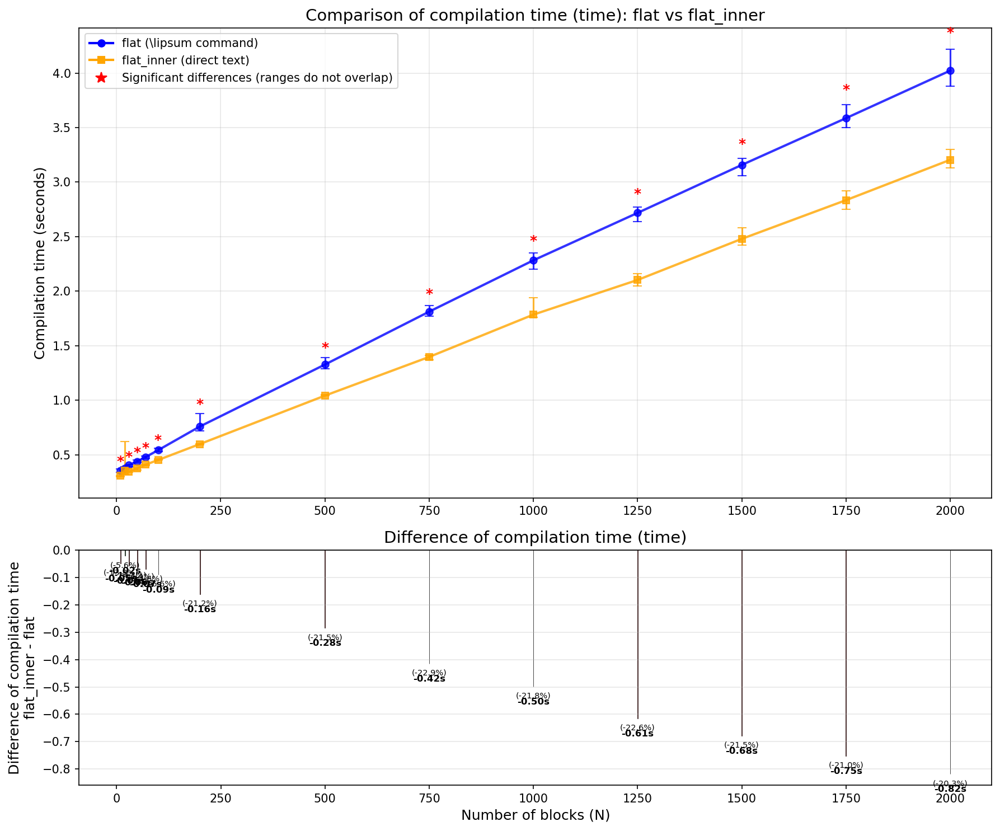
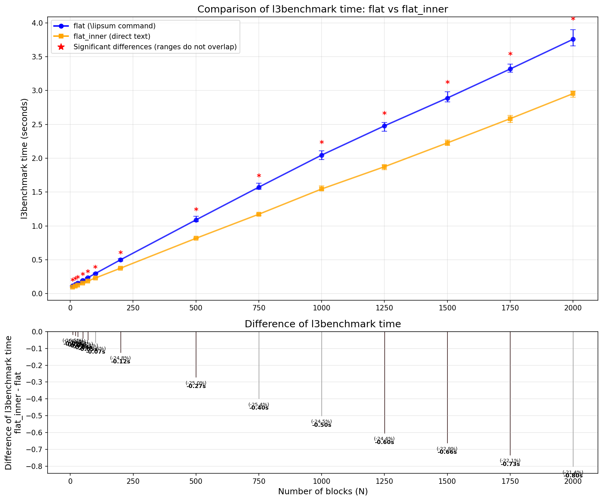
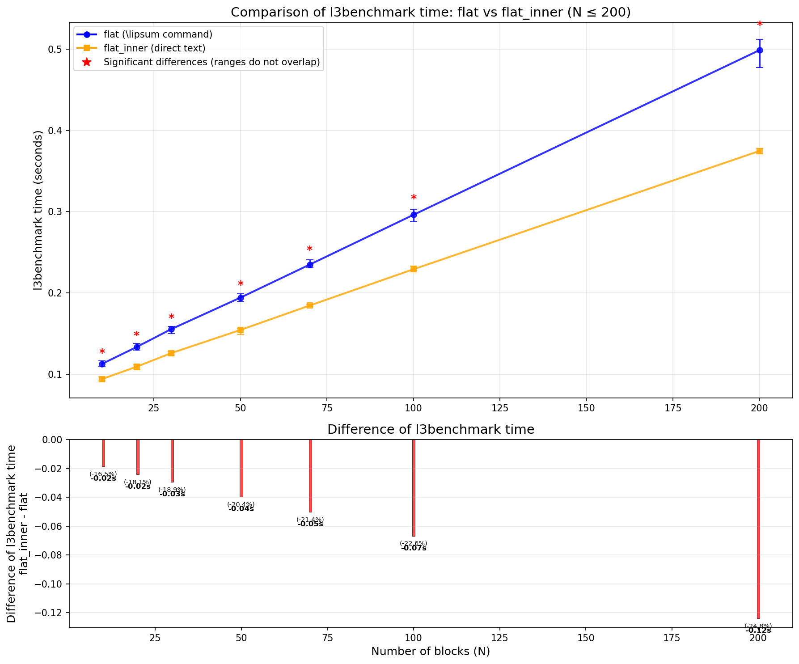

### Preliminary Information
First, we need to agree on the operating system and LaTeX distribution. I will be using Arch Linux (Kernel: Linux 6.17.9-arch1-1) and TeX 3.141592653-2.6-1.40.26 (TeX Live 2024/Arch Linux).

Next, we need to decide how and what we will measure.

#### How to Measure Time
Since our primary interest is the compilation time of `pdflatex <name>.tex`, we can simply use the `time` command. However, LaTeX has a package called `l3benchmark` which we can use to measure the time of interest, for example, as follows:
```tex
\RequirePackage{l3benchmark}
\ExplSyntaxOn
\AfterEndDocument { \benchmark_toc: }
\use:n
  {
    \benchmark_tic:
  }
\ExplSyntaxOff
```
(see this [answer](https://tex.stackexchange.com/questions/505770/how-to-measure-the-compilation-time-of-a-document))

We must also understand that, for instance, the time from `time` can vary greatly due to the influence of the operating system. The time measured using `l3benchmark` in the way described above, for example, does not include the TeX engine initialization time and the final processing for font inclusion.

Nevertheless, by performing several runs and finding the minimum, average, and maximum values, we will get a fairly good idea.

#### What to Measure

Now we need to decide what we will measure. The question states that `des.tex` and `data.tex` mainly contain one paragraph of text, with possible inclusion of formulas. For simplicity and based on your test example from the question, we will assume that `des.tex` and `data.tex` contain only one paragraph of text.

We also need a baseline against which we can observe and discuss whether the compilation time has changed significantly or not. In our case, this baseline will be a document where we directly inserted the blocks:
```tex
\documentclass[a4paper]{report}
\usepackage{graphicx}
\usepackage{geometry}
\usepackage{float}
\usepackage[language=english]{lipsum}
\usepackage{etoolbox}
\usepackage{l3benchmark}

\newcommand{\fig}[1]{\begin{figure}[H]\includegraphics{#1}\end{figure}}
\newcommand{\merge}[4]{\par\textbf{#1}\par\fig{#2}#3\par#4\par}

\ExplSyntaxOn
\AfterEndDocument { \benchmark_toc: }
\use:n
  {
    \benchmark_tic:
  }
\ExplSyntaxOff
\begin{document}

\merge{Block 1}{images/test-image-1.png}{\lipsum[2]}{\lipsum[3]}

\merge{Block 2}{images/test-image-2.png}{\lipsum[3]}{\lipsum[4]}

...

\merge{Block N}{images/test-image-N.png}{\lipsum[1]}{\lipsum[2]}

\end{document}
```
In the following narrative, it will be referred to as the `flat` document or document of type `flat`.

Для чистоты эксперимента мы также будем рассматривать вариант документа, в который текст добавляется не при помощи команды `\lipsum`, а напрямую, как в реальных документах. Это будет критически важно при анализе времени работы пакета `catchfilebetweentags`.

For the purity of the experiment, we will also consider a version of the document where the text is added not via the `\lipsum` command, but directly, as in real documents. This will be critically important when analyzing the performance of the `catchfilebetweentags` package.
For this, we will prepare a `lipsum.py` file where we specify the same text we would get from calling `\lipsum[1]`, `\lipsum[2]`, ..., `\lipsum[5]`. With one peculiarity: we will add a newline character after periods and commas:
```py
paragraphs = [  #
    """Lorem ipsum dolor sit amet, %
consectetuer adipiscing elit. %
Ut purus elit, %
vestibulum ut, %

Duis  nibh mi, %
congue eu, %
accumsan eleifend, %
sagittis quis, %
diam. %
Duis eget orci sit amet orci dignissim  rutrum.%
""",
...
```
Due to the specifics of the `catchfilebetweentags` package, we need to escape line breaks with `%`. We will return to this when discussing the package's drawbacks.

These tricks are only needed to obtain in the generated `des.tex` not just three lines
```tex
%<*Des1>
\lipsum[2]
%</Des1>
```
but several:
```tex
%<*Des1>
Nam dui ligula, %
fringilla a, %
euismod sodales, %
sollicitudin vel, %
...
nascetur ridiculus mus. %
Aliquam tincidunt urna. %
Nulla ullamcorper vestibulum turpis. %
Pellentesque cursus luctus mauris.
%</Des1>
```
Accordingly, when we add text directly, we will append `_inner` to the document type. Thus, our second baseline is measurements for documents of type `flat_inner`:
```tex
\documentclass[a4paper]{report}
\usepackage{graphicx}
\usepackage{geometry}
\usepackage{float}
\usepackage[language=english]{lipsum}
\usepackage{etoolbox}
\usepackage{l3benchmark}

\newcommand{\fig}[1]{\begin{figure}[H]\includegraphics{#1}\end{figure}}
\newcommand{\merge}[4]{\par\textbf{#1}\par\fig{#2}#3\par#4\par}
\ExplSyntaxOn
\AfterEndDocument { \benchmark_toc: }
\use:n
  {
    \benchmark_tic:
  }
\ExplSyntaxOff
\begin{document}

\merge{Block 1}{images/test-image-1.png}{%
Nam dui ligula, %
fringilla a, %
euismod sodales, %
...
Nulla ullamcorper vestibulum turpis. %
Pellentesque cursus luctus mauris.%
}{%
Nulla malesuada porttitor diam. %
Donec felis erat, %
congue non, %
...
Vestibulum pellentesque felis eu massa.%
}
...
```
We will proceed similarly for documents of type `modular`. In them we use:
```tex
%<*Des1>
\lipsum[2]
%</Des1>
```
and
```tex
%<*Data1>
\lipsum[3]
%</Data1>
```
And in `modular_inner`:
```tex
%<*Des1>
Nam dui ligula, %
fringilla a, %
...
Nulla ullamcorper vestibulum turpis. %
Pellentesque cursus luctus mauris.
%</Des1>
```
and similarly for `%<*Data1>`.

Also, personally, I found it interesting to measure the case where in `\ExecuteMetaData` we always refer to the very last tag, i.e., `%<*DataN>`, defined at the end of the `data.tex` document. Let's call such documents of type `modular_inner_last`. (Calculations will show that their time is comparable to `modular_inner`; details can be omitted.)

We will also measure the time for one of my proposed solutions using `\@namedef` and `\@nameuse`. Let's call such documents of type `macrodef`.

#### Brief Summary
Thus, we will have 6 different cases:

1. `flat` -- the closest analogue to the example given in the question, but without splitting into several `.tex` files.
2. `flat_inner` -- an analogue of `flat`, but the text is included directly, not via `\lipsum`.
3. `modular` -- the closest analogue to the example given in the question.
4. `modular_inner` -- an analogue of `modular`, but the text is included directly, not via `\lipsum`.
5. `modular_inner_last` -- an analogue of `modular_inner`, but always calling the last tag defined in `des.tex` and `data.tex`.
6. `macrodef` -- the solution using `\@namedef` and `\@nameuse.`

### Implementation of Measurements

As can be seen from the "Preliminary Information" section, we will need quite a few files and various measurements. To facilitate their creation and calculations, we will use scripts written in `Python`. For convenience, each script has a `-h` (`--help`) option to get detailed additional information.

Below I will also provide the commands I used myself to obtain the results presented later.

#### Image Generation
Since the question also uses images, we need to generate them. Let's use:
```bash
python ./generate_images.py -n 2000 \
 --font-size=12 \
 --size=120,60 \
 --seed=5217659638834040483 \
 -i ./info_image.log
```
Since the maximum number of blocks for which we will conduct measurements is 2000, we will immediately generate 2000 images. I also fixed the `seed` to allow generating similar images. (The randomness only affects the background color of the image, so it's not strictly necessary.)

#### Optional Generation

If there is any misunderstanding about what documents of various types (`flat`, `flat_inner`, ...) look like, you can generate a test example without measurements, just to look at or measure later manually, not via the `benchmark_latex.py` script.

So, for example, to get a file of type `flat`, you need to run:
```bash
python ./generate_flat_version.py -n 10
```
(To change the output directory, number of blocks, and other parameters, see `help`.)

To get a file of type `flat_inner`, you can use:
```bash
python ./generate_flat_version.py -n 10 --inner
```
To get a file of type `modular`:
```bash
python ./generate_modular_version.py -n 10
```
To get a file of type `modular_inner`:
```bash
python ./generate_modular_version.py -n 10 --inner
```
And to get a file of type `modular_inner_last`:
```bash
python ./generate_modular_version.py -n 10 --inner --last-tag
```

After that, you can call `time pdflatex ...` and get the time via `time` or, by analyzing the `.log` file, find the line:
```text
(l3benchmark) + TOC: 4.23 s
```

#### Obtaining Measurements

To automate obtaining results, the script `benchmark_latex.py` was written. For example, to get data for files of type `modular`, the following was used:
```bash
time python benchmark_latex.py \
--type modular \
--images-dir images -k 5 \
-o ./benchmark_result_modular/benchmark_result_modular.csv
```
This will perform measurements for `N` (number of blocks): `10, 20, 30, 50, 70, 100, 200, 500, 750, 1000, 1250, 1500, 1750, 2000`.
And for each `N`, we repeat the run `k` times to get the minimum, maximum, and average values.

This process may take some time depending on which and how many `N` values you specified, as well as the number specified for the `k` option. In my case, the command above took about 7 minutes. A similar command for `modular_inner`:
```bash
time python benchmark_latex.py \
--type modular_inner \
--images-dir images -k 5 \
-o ./benchmark_result_modular_inner/benchmark_result_modular_inner.csv
```
took about 30 minutes.

After executing the above commands, we will get the `experiment` directory:
```bash
./experiment
├── flat
│   ├── flat_10
│   ├── flat_20
│   ├── flat_30
│   ...
│   ├── flat_1500
│   ├── flat_1750
│   └── flat_2000
├── modular
│   ├── modular_10
│   ├── modular_20
│   ├── modular_30
│   ...
│   ├── modular_1500
│   ├── modular_1750
│   └── modular_2000
├── modular_inner
│   ├── modular_inner_10
│   ├── modular_inner_20
│   ├── modular_inner_30
│   ...
│   ├── modular_inner_1500
│   ├── modular_inner_1750
│   └── modular_inner_2000
...
├── macrodef
│   ├── macrodef_10
│   ├── macrodef_20
│   ├── macrodef_30
│   ...
│   ├── macrodef_1500
│   ├── macrodef_1750
│   └── macrodef_2000
└── flat_inner
    ├── flat_inner_10
    ├── flat_inner_20
    ├── flat_inner_30
    ...
    ├── flat_inner_1500
    ├── flat_inner_1750
    └── flat_inner_2000
```
In each, there will be a `main.tex` document, for some types also `data.tex`, `des.tex`, and the result of the last of the `k` runs.

And in the `.csv` files specified during the run, the direct results.

### Visualization of Results

After that, we only need to visualize the `.csv` files. For this, we will again use scripts.

#### flat vs flat_inner

First, let's note the difference between `flat` and `flat_inner`.
To build we will use the command.
```bash
python plot_flat_comparison.py \
--flat-csv ./benchmark_result_flat.csv \
--flat-inner-csv ./benchmark_result_flat1.csv \
--output-dir plot_flat_vs_flat_inner
```
##### Using time
 


##### Using l3benchmark

 

As expected, the build time will be faster without calling `\lipsum`. We also see the expected fluctuations when measuring using `time`.

Since `flat_inner` is slightly faster than `flat`, we will take it as the baseline. (In the `plot_latex_benchmark.py` script, you can set a different baseline, see `--help`.)

#### Main Results

To obtain the main results, we use the following commands:
```bash
python plot_latex_benchmark.py \
--baseline=flat_inner \
--input-csv ./benchmark_result_flat_inner/benchmark_result_flat_inner.csv \
--input-csv ./benchmark_result_modular/benchmark_result_modular.csv \
--input-csv ./benchmark_result_modular_inner/benchmark_result_modular_inner.csv \
--input-csv ./benchmark_result_macrodef/benchmark_result_macrodef.csv \
--input-csv ./benchmark_result_modular_inner_last/benchmark_result_modular_inner_last.csv \
--output-dir plots
```
and
```bash
python plot_latex_benchmark.py \
--max-n=200 \
--baseline=flat_inner \
--input-csv ./benchmark_result_flat_inner/benchmark_result_flat_inner.csv \
--input-csv ./benchmark_result_modular/benchmark_result_modular.csv \
--input-csv ./benchmark_result_modular_inner/benchmark_result_modular_inner.csv \
--input-csv ./benchmark_result_macrodef/benchmark_result_macrodef.csv \
--input-csv ./benchmark_result_modular_inner_last/benchmark_result_modular_inner_last.csv \
--output-dir plots_200
```

Let's consider the main results, first for $N\le200$:


 

If we look at the factor by which the compilation time increases, the results seem terrible. There is a very large increase in time. However, if we look at the difference, up to 50-70 blocks the difference is less than 0.2 seconds, which can rather be attributed to measurement error. Optimizing this would probably be excessive.

We should also note the stark difference between `modular` and `modular_inner`. If the `<Data>` and `<Des>` blocks are simple and short, the `catchfilebetweentags` package successfully handles parsing `des.tex` and `data.tex`.

However, if the blocks increase in size (in the sense that, for convenience, we decide to split the text into multiple lines, inserting not just a single `\lipsum` command, but the text itself), the `catchfilebetweentags` package will take significantly more time. This is worth remembering because in real life, files are likely to resemble `modular_inner` more than `modular`.

Also remember that `pdflatex` is usually run not once, but several times, and this difference can be multiplied by 2 or more.

 


For $N > 100$ (or $>200$), the performance of catchfilebetweentags looks even worse.
Several other plots can be found in the `plots` and `plots_200` directories, respectively.

### Alternative Solution

It's difficult to suggest an alternative solution that would perfectly fit your task because, for example, it's unclear how the `data.tex` and `des.tex` files are obtained. If they are generated via an external script, that's one thing. If you create them manually, that's another.

Nevertheless, for the task you described, I personally would not use the `catchfilebetweentags` package. It hasn't been updated for a long time -- the last update was 2011-02-19. Moreover, a search online reveals [questions and answers](https://tex.stackexchange.com/questions/477585/catchfilebetweentags-not-working) pointing out errors in its behavior. Also, its limitations on content, changed character codes can lead to problems with [other packages](https://tex.stackexchange.com/questions/362110/conflict-between-catchfilebetweentags-and-a-kind-of-arrow-from-xypic-argument-o?rq=1) or undesirable modification of the entire `.tex` project if it later turns out that, for example, data.tex can contain not just text and simple math inserts.

As an alternative, specifically for this task, I would probably use `\@namedef` and `\@nameuse`. You can read about them in detail in this [excellent answer](https://tex.stackexchange.com/questions/126273/correct-usage-of-namedef-and-nameuse) by Joseph Wright. (When choosing this alternative solution, I also assumed that we already have `data.tex` and `des.tex` files with tags for catchfilebetweentags and now we need to change these files for a new, higher-performance solution.)

Change:
```tex
%<*Des1>
Nam dui ligula, %
fringilla a, %
...
Nulla ullamcorper vestibulum turpis. %
Pellentesque cursus luctus mauris.
%</Des1>
```
to
```tex
\@namedef{desDes1}{%
Nam dui ligula, %
fringilla a, %
...
Nulla ullamcorper vestibulum turpis. %
Pellentesque cursus luctus mauris.%
}
```
where I add the prefix `des` based on the filename `des.tex`.

Similarly in `data.tex`:
```tex
\@namedef{dataData1}{%
Nulla malesuada porttitor diam. %
Donec felis erat, %
...
Nam vulputate metus eu enim. %
Vestibulum pellentesque felis eu massa.%
}
```
(The `%` at the end can now be removed.)

Now in `main.tex`, change `\merge` to:
```tex
\newcommand{\fig}[1]{\begin{figure}[H]\includegraphics{#1}\end{figure}}
\makeatletter
\newcommand{\merge}[4]{\par\textbf{#1}\par\fig{#2}\@nameuse{#3}\par\@nameuse{#4}\par}
\makeatother
```

Now, either in the preamble or after `\begin{document}`, we need to include the `data.tex` and `des.tex` files. I include them after to avoid any suspicion that `l3benchmark` simply doesn't account for the time to include them (If doubts still arise, I also perform measurements using `time`).
```tex
\begin{document}
\makeatletter
% Load all macros from external files
\input{des.tex}
\input{data.tex}
\makeatother
```
(`\makeatletter` and `\makeatother` can be placed inside the included files to avoid cluttering `main.tex`.)

You can review the full code and experiment by generating an example without measurements using `generate_macro_version.py` (see `--help`).
```bash
python ./generate_macro_version.py -n 50
```
As seen earlier from the graphs, the compilation time is comparable to `flat` and `flat_inner`:


Also, if, for example, we use `expl3`, we could create a property list (`prop`) to track which `desDesN` or `dataDataN` we haven't used and issue a warning at the end, etc. To not slow down the "release" version, we could make this an option, so the check only works when "debug" is specified, thereby improving control over fragments.

However, this solution also has drawbacks -- for example, we still cannot use `\verb` and a number of other fragile commands. But the task does not require this.


### Conclusion

Based on the conducted comparison, several practical conclusions can be drawn:

1. **For small projects (up to ~50 blocks)**, the difference in compilation time between the different approaches is negligible (fractions of a second). In this case, the choice of method can be based on convenience and personal preference.

2. **For medium and large projects (from 100 blocks and more)**, using the `catchfilebetweentags` package leads to a noticeable increase in compilation time, especially if text fragments are not encapsulated in macros (type `modular_inner`). This is critical for iterative compilation when `pdflatex` is run multiple times.

3. **The `catchfilebetweentags` package should be considered with caution** due to its long absence of updates, known compatibility issues, and sensitivity to input data format.

4. **The alternative solution** based on `\@namedef` and `\@nameuse` demonstrates performance comparable to "flat" (`flat_inner`) text inclusion and is a more predictable approach. It is well-suited for the tasks described in the original question.

I hope this analysis proves useful. Good luck optimizing your documents!